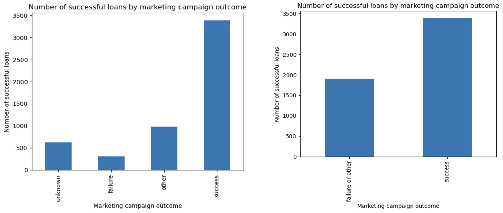
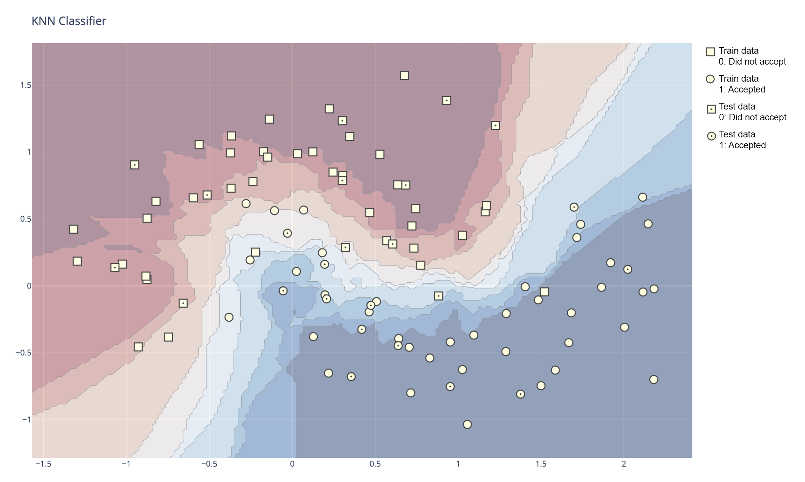
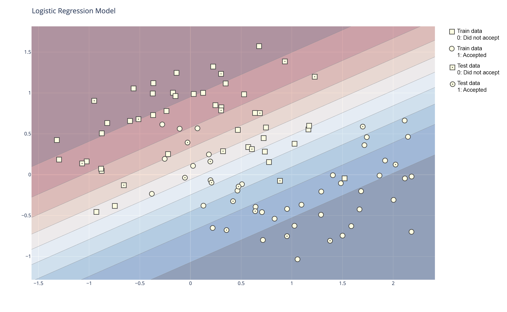
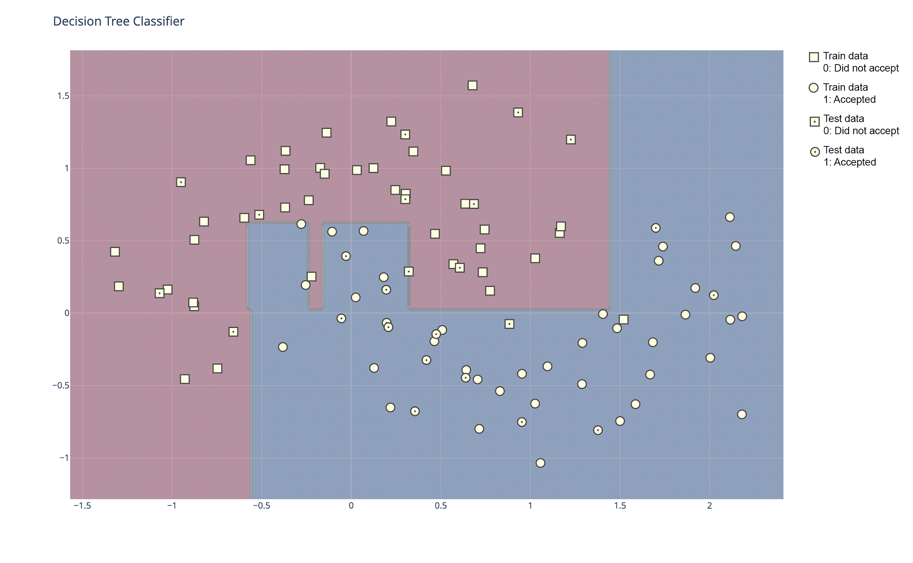

# Comparing Classifiers
 Comparing the performance of k-nearest neighbors, logistic regression, decision trees, and support vector machines

The data is related with direct marketing campaigns of a Portuguese banking institution. The marketing campaigns were based on phone calls. Often, more than one contact to the same client was required. The classification goal is to predict if the client will subscribe (yes/no) a term deposit (variable y).

There are two datasets: 
1) bank-full.csv with all marketing data and 17 inputs, ordered by date 
2) bank.csv with a 10%, randomly selected dataset from the bank-full.csv

I used the sample of this data for the computational demanding vector machine classification.

## Variable details
Below is a detail of each variable in the dataset.  Each row represents a unique customer and serves as the unique identifier for each individual.
 
| Variable Name |   Data type  |   Description                                            |
|:--------------|:------------:|---------------------------------------------------------:|
|      Age      |    Integer   |                                                          |
|      Job      | Categorical  |  Occupation, ex: admin, blue-collar, retired, unemployed |    
|    Marital    | Categorical  |  Married, single, divorced                               |  
|   Education   | Categorical  |  Tertiary, secondary, primary, unknown                   |  
|    Default    |   Binary     |  Credit in default? yes or no                            |  
|    Balance    |   Integer    |  Average yearly balance                                  | 
|    Housing    |   Binary     |   Has housing loan? yes or no                            | 
|      Loan     |   Binary     |   Has personal loan? yes or no                           | 
|    Contact    | Categorical  |   Contact communication type (cellular, telephone)       | 
|       Day     |   Integer    |   Day of the week of last contact                        | 
|     pdays     |   Integer    |  Number of days since last contact (-1 means no contact) | 
|   Previous    |   Integer    |   Number of contacts performed before this campaign      | 
|   poutcome    | Categorical  |  Outcome of previous campaign: unknown, failure, success | 

## Preparing the data
All of the categorical data was converted into numeric values using the Label encoder.  Upon analyzing the "poutcome" data values, I noticed that there was repetition within the outcome values.  I converted this column to boolean, making success = 1, and non-success (other, unknown, failure) = 0.  Below you can see the comparison of the conversion of these values as they relate to the loan success.

## Selecting the best model

THe KNN classifier (13 neighbors and Euclidian metric) was 89.2% accurate.
The logistic regression classifier was 88% accurate.
The decision tree classifier was 88% accurate.
The support vector classifier (using the linear kernel) was 89.1% accurate.

The KNN classifier performed the best, followed closely by the support vector classifier.  The logistic regression and decision tree classifiers performed the worst, although by a small margin.

Going forward, I recommend using the KNN classifier to determine which customers will accept the terms of the deposit.

## Visualizing the Classifiers

### KNN Classifier

### Logistic Regression Classifier

### Decision Tree Classifier

### Support Vector Classifier
This decision boundary refused to form a visual plot.  Suggestions welcome.